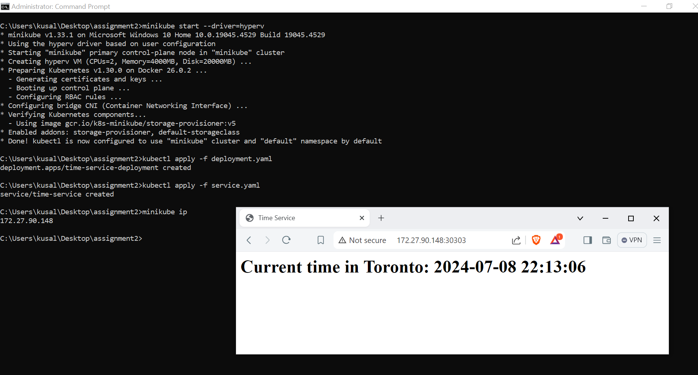

# Python Application Deployment on Kubernetes

This project-2 folder contains a Python web application that displays the current time in Toronto, Canada, deployed using Kubernetes on Minikube with Hyper-V driver.

## Prerequisites
Before you begin, ensure you have the following installed:
- Docker Desktop
- Minikube with Hyper-V driver enabled

## Steps to Deploy

### 1. Enable Hyper-V and Set Minikube Driver
Ensure Hyper-V is enabled on your Windows machine and set the Minikube driver to Hyper-V:
```bash
minikube config set driver hyperv
```

### 2. Start Minikube
Start Minikube with the Hyper-V driver:
```bash
minikube start --driver=hyperv
```

### 3. Apply Kubernetes Manifests
Apply the Kubernetes Deployment and Service manifests to deploy the Python application::
```bash
kubectl apply -f deployment.yaml
kubectl apply -f service.yaml
```

### 4. Get the Minikube IP address:
```bash
minikube ip
```

### 5. Access the application via the NodePort using the following URL:
```bash
http://<minikube-ip>:30303
```

## Final Output
